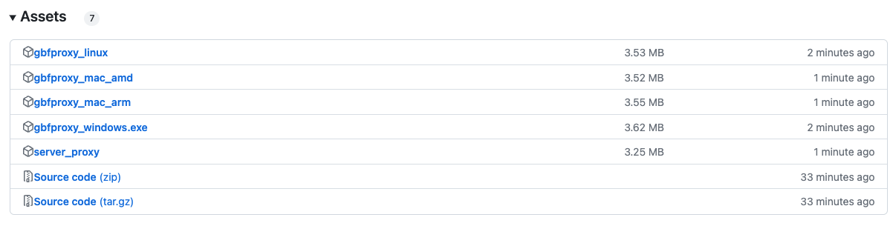
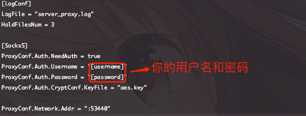
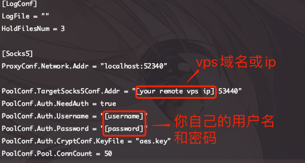
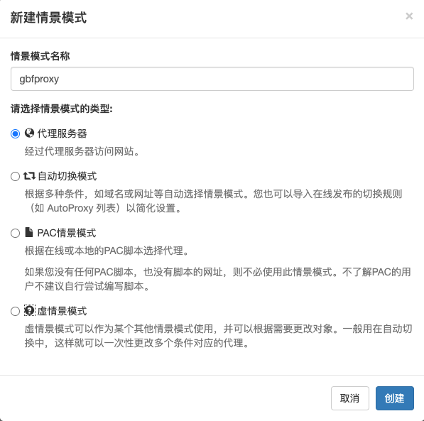
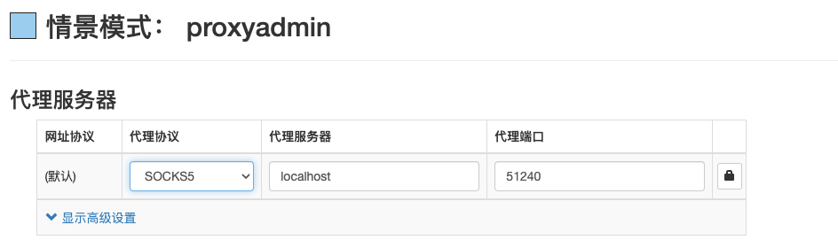

## GBFPROXY简介

---


为使用国内专线而被各种偷流量的gbf player定制的鉴权代理

---

## 为什么此代理可以防止被偷流量？
- 被偷流量的本质，是因为大部分朋友专线使用的代理为[goproxy](https://github.com/snail007/goproxy)，在脑死亡版本的代理配置中使用了socks5，但服务器没有对请求做鉴权
- 本代理虽然也使用了socks5协议做代理，但在服务端（vps）测使用了socks5用户名密码的认证方式，并有配套的客户端实现，双端会使用对称加密（aes）对您的用户名和密码辅以时间戳进行加密。因此别人想偷流量，不仅得拿到您的用户名和密码，同时还得拿到您的aes密钥，狠狠地对流量小偷进行了一波反击

## 如何配置代理


### 服务端配置
- 下载server_proxy，并上传到你的vps；或者直接使用以下命令：
```shell
wget https://github.com/chikasaki/gbfproxy/releases/download/v1.0/server_proxy
chmod +x server_proxy
```
- 配置`server_config.toml`，具体的配置可以直接拷贝`server_config_template.toml`，并按下图修改

- 随便找一个[aes密钥生成器](https://www.imaegoo.com/2020/aes-key-generator/)，生成一个256-bit的密钥。创建一个名为：`aes.key`的文件，将生成的密钥拷贝进去
- 使用命令`nohup ./server_proxy > nohup.out 2>&1 &`启动服务端代理

### 客户端配置
- 首先根据您自身使用的操作系统，选择合适的gbfproxy版本
- 将`client_config_template.toml`改名为`client_config.toml`，并按下图进行修改

- 将在服务端配置中生成的密钥，复制进本地创建的`aes.key`文件中
- 启动客户端

### switchyomega配置
- 新建情景模式，选择代理服务器

- 代理协议选择socks5，代理服务器为localhost，代理端口为51240


## 配置完毕，你可以开始使用了
