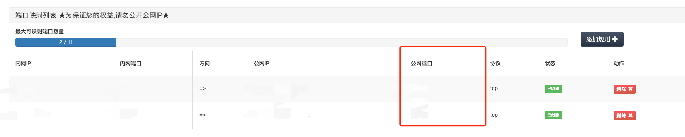
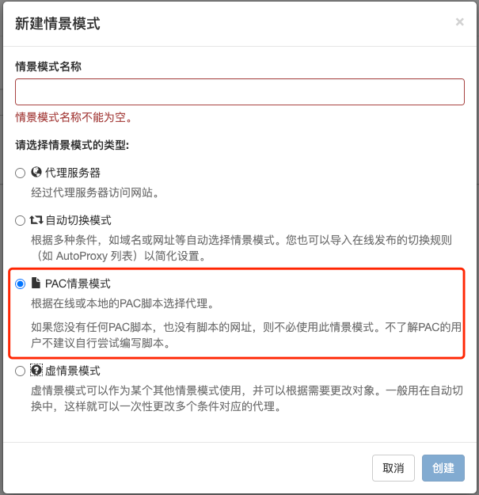
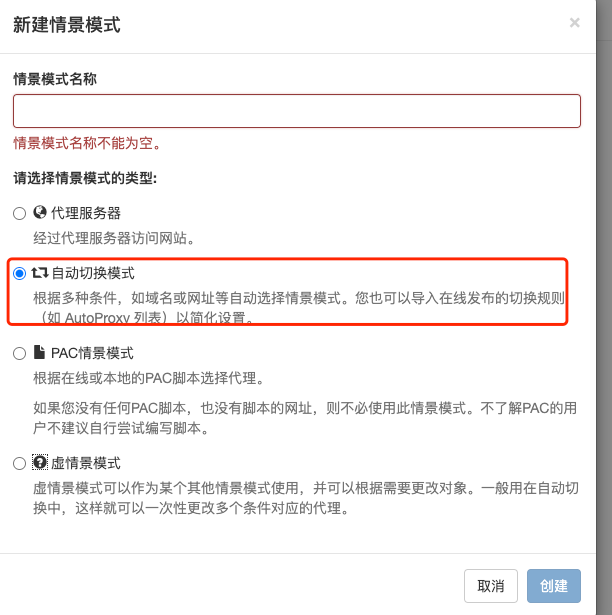
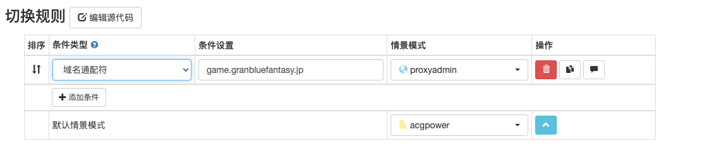

## GBFPROXY简介

---


为使用国内专线而被各种偷流量的gbf player定制的鉴权代理

---

## 为什么此代理可以防止被偷流量？
- 被偷流量的本质，是因为大部分朋友专线使用的代理为[goproxy](https://github.com/snail007/goproxy)，在脑死亡版本的代理配置中使用了socks5，但服务器没有对请求做鉴权
- 本代理虽然也使用了socks5协议做代理，但在服务端（vps）测使用了socks5用户名密码的认证方式，并有配套的客户端实现，双端会使用对称加密（aes）对您的用户名和密码辅以时间戳进行加密。因此别人想偷流量，不仅得拿到您的用户名和密码，同时还得拿到您的aes密钥，狠狠地对流量小偷进行了一波反击

## 如何与朋友共享使用
在你按照下面步骤搭建完服务端之后和客户端之后，可以将客户端的几个文件：gbf_windows.exe，aes.key，client_config.toml压缩打包，直接发给你的好友，好友解压之后只需要进行switchyomega配置，就可以直接使用你的代理了

## 如何配置代理


### 服务端配置
- 如果你的vps没有安装vim，请先使用以下命令安装，如果操作过这一步了可跳过：
```shell
sudo yum install vim
```
- 使用以下命令下载压缩包并解压，并运行脚本，根据提示输入用户名、密码、以及端口号（可不填，直接回车即可）
```shell
wget https://github.com/chikasaki/gbfproxy/releases/download/v1.2/gbf_proxy.zip
unzip gbf_proxy.zip; cd gbf_proxy
chmod +x server_proxy, server_deploy.sh, restart_server.sh
./server_deploy.sh
```
- 打开vps管理平台，新增一个端口映射规则，内网端口为53540，如果你在执行上述命令时手动修改了端口号，则内网端口填写对应的端口号；公网端口号随意填，下面客户端配置的时候会用到
- 如果你需要重设密码，请重新执行以下命令：
```shell
./server_deploy.sh
```
请注意，此操作会重新生成aes.key，进行该操作之后，需要在客户端（也就是你的windows机器上）测，一并修改aes.key文件的内容
- 如果你只需要重启服务，请执行以下命令：
```shell
./restart_server.sh
```

### 客户端配置
- [首先根据您自身使用的操作系统，选择合适的gbfproxy版本；大部分人应该使用的都是windows，所以直接下载gbfproxy_windows.exe文件即可](https://github.com/chikasaki/gbfproxy/releases/tag/v1.2)
  
- 将`client_config_template.toml`改名为`client_config.toml`，并按下图进行修改；[模版文件地址](https://github.com/chikasaki/gbfproxy/blob/main/client_config_template.toml)

- 对于`client_config.toml`的端口号，还需要在特意说明一下（PoolConf.TargetSocks5Conf.Addr = "ip:port"），这里的port值，取的是公网端口列的值

- 将在服务端配置中生成的密钥，复制进本地创建的`aes.key`文件中
```shell
在vps中输入: vim aes.key
将内容直接复制到windows的同名文件即可
```
- 双击启动客户端

### switchyomega配置
这里有两种配置方式，可任选其一：
1. 配置pac脚本，如果你本身也续费了acgpower，推荐用这种方式，可以控制只让少数的gbf请求走代理，大部分gbf图片缓存可以用acgp的缓存能力。但是，请注意使用该方式的时候，你要先把acgp打开，不然用不了
  - 新建情景模式，选择pac情景模式：
  - 将下面脚本直接复制到pac脚本输入框中：
```javascript
var ver=1;var proxy_host=[
"203.104.209.7",
"203.104.209.71",
"203.104.209.87",
"125.6.184.215",
"203.104.209.183",
"203.104.209.150",
"203.104.209.134",
"203.104.209.167",
"203.104.209.199",
"125.6.189.7",
"125.6.189.39",
"125.6.189.71",
"125.6.189.103",
"125.6.189.135",
"125.6.189.167",
"125.6.189.215",
"125.6.189.247",
"203.104.209.23",
"203.104.209.39",
"google.com",
"google.co.jp",
"google.com.hk",
"wikiwiki.jp",
"g.doubleclick.net",
"simg.jp",
"googleapis.com",
"gstatic.com",
"googleusercontent.com",
"ggpht.com",
"dmm.com",
"www.dmm.co.jp",
"my.dmm.co.jp",
"osapi.dmm.co.jp",
"sp.dmm.co.jp",
"s3-ap-northeast-1.amazonaws.com",
"203.104.209.55",
"goo.gl",
"touken-ranbu.jp",
"dovs9u514acja.cloudfront.net",
"web.flower-knight-girls.co.jp",
"flower-help.s3-website-ap-northeast-1.amazonaws.com",
"res.nimg.jp",
"googleusercontent.com",
"googletagmanager.com",
"google-analytics.com",
"203.104.209.102",
"millennium-war.net",
"flower-knight-girl.cdn.dmmgames.com",
"dugrqaqinbtcq.cloudfront.net",
"assets.shiropro-re.net",
"api.shiropro-re.net",
"kamihimeproject.net",
"mbga.jp",
"gbf-wiki.com",
"granbluefantasy.jp",
"rcv.ixd.dmm.co.jp",
"pics.dmm.co.jp",
"p.dmm.co.jp",
"games.dmm.co.jp",
"yashiro.dmmgames.com",
"d2l18yyka3zu4o.cloudfront.net",
"db695krnj9c0z.cloudfront.net",
"accounts.dmm.co.jp",
"image01.seesaawiki.jp",
"image02.seesaawiki.jp",
"r.cdn.aimia.dmmgames.com",
"mobage.jp",
"w.kcwiki.moe",
"cdnjs.cloudflare.com",
"203.104.248.5",
"assets.smrtbeat.com",
"control.smbeat.jp",
"unpkg.com",
"aimg-link.gree.net",
"googlevideo.com",
"code.createjs.com",
"blhx.danmu9.com",
"navismithapis-cdn.com",
"dmm-extension.com",
"drc1bk94f7rq8.cloudfront.net",
"cdn.ravenjs.com",
"connect.mobage.jp",
"johren.games",
"gamewith.jp",
"prd-game-a-granbluefantasy.akamaized.net","prd-game-a1-granbluefantasy.akamaized.net","prd-game-a2-granbluefantasy.akamaized.net","prd-game-a3-granbluefantasy.akamaized.net","prd-game-a4-granbluefantasy.akamaized.net","prd-game-a5-granbluefantasy.akamaized.net",
"prd-game-a-gbf.akamaized.net","prd-game-a1-gbf.akamaized.net","prd-game-a2-gbf.akamaized.net","prd-game-a3-gbf.akamaized.net","prd-game-a4-gbf.akamaized.net","prd-game-a5-gbf.akamaized.net","prd-game-a6-gbf.akamaized.net"
];
function FindProxyForURL(url, host) {
	try{
		if(ver>=1){
			if(host==="203.104.248.14"||host==="ws.game.granbluefantasy.jp"){
				return "SOCKS5 127.0.0.1:52340";
			}
			if(host==="content-autofill.googleapis.com"){
				return "SOCKS5 127.0.0.1:52340";
			}
                        if (new RegExp("\\.akamaized.net$").test(host)) {
                                return "PROXY 127.0.0.1:8123";
                        }
                        if (new RegExp("\\.granbluefantasy.jp$").test(host)) {
                                return "SOCKS5 127.0.0.1:52340";
                        }
 		}
	}catch(e){}
    for(var i=0;i<proxy_host.length;i++){
		var ph=proxy_host[i];
		if(ph===host||new RegExp("\\."+ph + "$").test(host)){
			return "PROXY 127.0.0.1:8123";
		}
	}
    return "DIRECT";
}
```
  - 应用选项即可

2. 配置代理服务器，通过autoswitch只让gbf相关的流量走vps，其他的网站（比如百度等）都是正常直连或者走你想要走的代理
  - 新建情景模式，选择代理服务器: 
  - 代理协议选择socks5，代理服务器为localhost，代理端口为52340（图片端口号写错了，请注意）：
  - 新建情景模式，选择自动切换模式：
  - 指定只有gbf的域名走vps代理，选择的情景模式是第一、二步配置的情景模式：
## 配置完毕，你可以开始使用了
